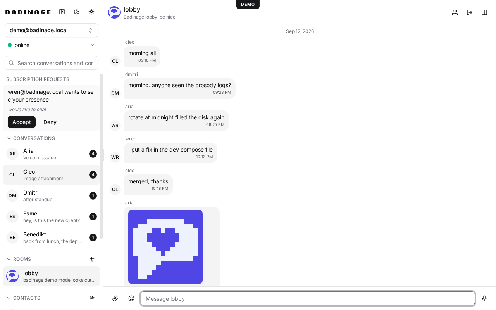

# Badinage

> [!WARNING]
> This project is still alpha level software and being actively developed.

[](https://scorecard.dev/viewer/?uri=github.com/Quad4-Software/Badinage)

A self-hostable web XMPP client. Connects to any existing
XMPP server over WebSocket or BOSH, supports multiple accounts at once.

**[Try the live demo](https://quad4-software.github.io/Badinage/)**

<picture>
  <source media="(prefers-color-scheme: dark)" srcset="docs/screenshot-dark.png" />
  
</picture>

## Features

- Chat like you expect: DMs and group chats, replies, reactions, edits,
  attachments, voice messages, typing and read indicators
- All your accounts in one place
- Works offline and feels fast: messages cached locally, resizable and
  split panes, dark mode, keyboard-first
- Private by design: OMEMO encryption is our own permissively licensed
  implementation, validated against the reference stack
- Self-host anywhere: static files behind any web server, or the included
  Docker image

## Install

Requires Node 22+ and pnpm 11+.

```sh
pnpm install
pnpm dev
```

## Build from source

```sh
pnpm build
```

Static output lands in `dist/`, serve it with any web server.

## Docker

The production image is multi-stage, rootless, digest-pinned, and published
to `ghcr.io/quad4-software/badinage` with keyless cosign signatures.

```sh
docker run -p 8080:8080 ghcr.io/quad4-software/badinage:latest
```

Or build locally:

```sh
docker compose -f docker/compose.yaml up --build
```

The dev stack under `docker/dev/` adds a local Prosody server:

```sh
docker compose -f docker/dev/compose.yaml up
```

## Verify

```sh
pnpm check     # types + svelte diagnostics
pnpm lint      # eslint
pnpm test      # unit tests
pnpm test:e2e  # playwright, needs browsers installed
pnpm test:omemo # OMEMO library tests incl. interop vectors
```

Regenerate icons and the README screenshot:

```sh
pnpm icons       # pixel-art logo, favicons, PWA icons, og image
pnpm screenshot  # demo-mode screenshots to docs/screenshot{,-dark}.png
```

## License

0BSD, see [LICENSE](LICENSE).
